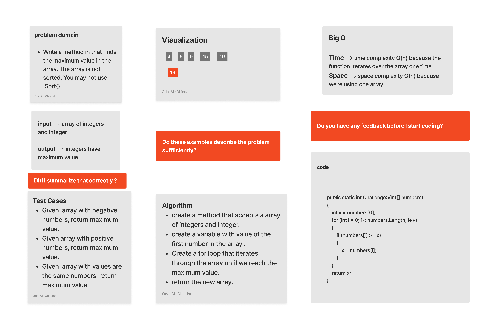

# Challenge5
Write a method in that finds the maximum value in the array. The array is not sorted. You may not use .Sort()

### Solution
*[Solution](https://github.com/Ody950/Lab03-Class03/Lab03-Class03/Program.cs)*

*[Unit Test codecha-1](https://github.com/Ody950/Lab03-Class03/TestLab3/UnitTest1.cs)*
